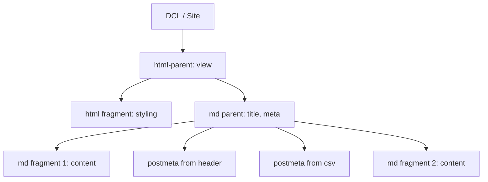

## snc
16067.1.include


## DCL website: vorschlag für ein alternativkonzept zur derzeitigen gestaltung
entgegen unseren ersten annahmen dient die website des dahlem center for linguistics laut auskunft der verantwortlichen wesentlich dazu, knappe uni- bzw. wissenschaftsinterne kommunikation über vom center vertretene projekte zu gewährleisten. dabei beschränkt sich der inhalt auf eine kurze vorstellung der projekte und verantwortlichen und verlinkung externer seiten, auf denen näheres zu finden ist und die selbstverantwortlich gestaltet werden bzw. in weitere informationsstrukuren (zb. DFG) eingebettet sind.
in aufbau und informationsgehalt ähnelt die seite deshalb auch sehr den uniseiten andere institute oder fachbereiche, die nur oberflächlich zukünftigen studierenden oder fachpublikum einen überblick über das angebot geben wollen. wer sich aber wirklich für eines der projekte interessiert, wird hier neben dem summary selten mehr als die namen der jeweiligen ansprechpartner oder beteiligten und evtl. noch einige öffentliche termine finden.

### motivation
an dieser stelle möchte ich mit meinem vorschlag ansetzen, denn es scheint so, als wenn für die mangelnden hintergrundinformationen bzw. fehlende aktualität allein die art und weise verantwortlich ist, wie die inhalte auf die seiten kommen. diese sind eingebunden in das fu weite content management system und aus diesem grund nicht wirklich individuell bespielbar; nur sehr wenige user mit beschränkten kapazitäten haben rechte, dort content einzupflegen, was dann eben in sehr statischen, rein organisatorisch anmutenden seiten mündet.

hier könnte ein cms, das die projektverantwortlichen in die contenterstellung einbindet, zu mehr (vividness) beitragen und bei besuchern den eindruck lebendiger projekter machen, die in-progress sind und reaktionsfähig. das würde dazu anregen, auch öfter auf den seiten vorbeizuschauen, um über ein projekt auf dem laufenden zu bleiben, wenn man sich dafür interessiert.

### tech
ein relativ einfach zu handhabendes und stetig aktualisiertes framework zur erstellung (statischer) webseiten ist **Jekyll**. dieses beruht im wesentlichen darauf, html content (der auf der seite abgespielt wird) aus markdown (.md) files zu generieren (=zu rendern). dabei können viele cms features, die sonst nur über ein datenbanksystem (bei wordpress zb., oder dem fu system)[^1] erreicht werden können, emuliert werden, so dasz der content zwar statisch (als markdown datei) vorliegt und nicht dynamisch generiert wird, aber trotzdem aktuell sein kann. dabei kann auch auf text, der in .csv tabellen gespeichert ist, zurückgegriffen werden. jekyll ist hier ein hauptsächlich template basiertes system, das vielfältige einbettung von inhalten aus separat gespeicherten quellen erlaubt, eben aus .html, .txt, .md oder .csv.

#### visualisierung
zum beispiel diese seite wird aus vielen unabhängig voneinander existierenden templates generiert, die teilweise entweder als html fragmente vorliegen und auch selten geändert werden müssen, einem übergeordneten post und mehreren primär zu bearbeitenden markdown texten.

[^1]:	mit komplexem user management