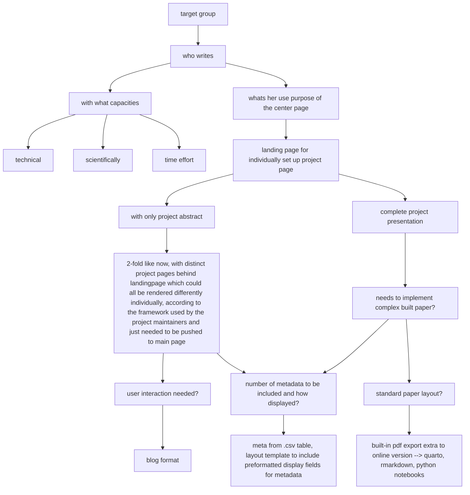

# SNC
- manually triggered wks.
- push trigger wks., now remove static wf, wks.
- add cats, add post
- 16465. try post via ulysses external folder

# view paper: just testing
- [pdf][1] / [page][2] / [folien][3]

[1]:	../../ha-docs/spund-pub.pdf
[2]:	../../ha-docs/index.html
[3]:	../../ha-docs/folien/2025-10-22/index.html

# codeblocks
how code looks: R
```r
get.r<-function(s){
  basis<-3
  x<-basis+s
  
  
  i<-x-basis
  p<-i-1
  q<-x^i
  y<-x+p
  z<-y^i
  q<-z
  r1<-q/x
r2<-sqrt(q)
print(r1)
print(r2)
print(z)
print("---")
print(i<-z^r2)
print((b<-z*1/r1))
print(q<-(z*1/r1)*x)
#print(q)
print(r1<-sqrt(q))
}
get.r(0)
```


# .rb test call
this Hello should be replaced by a dummy var. its not. was, but no

## issues
### render save
16514.1: restored _meta_information.html to original : now meta foot is okay, but theres no content in posts (on server, local wks.) wheres csv meta inserted for view, only posts with no <view>. found some more comment out issues, maybe wks only local.

```html
issue with comments on pages? did comment out some content in .md
and did comment out a line in _meta_information.html like
<p>start meta...</p>
<!--<p---> instead <!-- <p> -->
    is that an issue for rendering? local renders fine but not on git.
    now after deleting that comment its still messed up layout.
    removed in this post commented section. maybe content mustnt be empty.
push.
or: maybe sites are not rendered new if content isnt changed but only template.
```

- [x] solved: grande heureka: it seems as if render the liquid pages on mac has no problems with commented html like above, but on the github linux the pages with such comments are messed up.


## play
### try embed fixed.


<!--  -->

### convert list to mermaid block



- Step 1
  - understep
- Step 2
  - understep 2
- Step 3
  - understep 3
    - next step
  - some step
- step 4



### working plain



