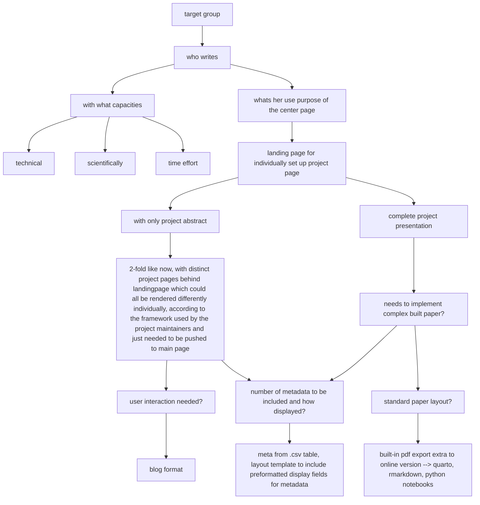

# 16453.draft.project



# dahlem center for linguistics site proposal

- CMS backend based on github workflow
- why:
	- FU CMS used (wordpress + single sign on) forces users to use wordpress UI or worst case deliver finalised content which authenticated users then post to database \> this could prevent users to continually work on posts or post content actively
	- github offers several static (=no DB needed) approaches to allow unlimited users to create content based on simple .csv tables or .md or plain texts which then are rendered to html frontend which is dependent on framework more or less customizable
- caveats:
	- public data storage
	- anyone with access can edit anything / admins have to keep track of organisation users

## preliminary
- target group
- who writes
	- with what capacities
		- technical
		- scientifically
		- time effort
	- whats her use purpose of the center page
		- landing page for individually set up project page
			- with only project abstract
			- (2-fold like now, with distinct project pages behind landingpage which could all be rendered differently (individually, according to the framework used by the project maintainers) and just needed to be pushed to main page)
		- complete project presentation
			- needs to implement complex built paper?
			- standard paper layout?
			  - built-in pdf export extra to online version  -- quarto, rmarkdown, python notebooks
		- user interaction needed?
			- blog format
		- number of metadata to be included and how displayed?
		  - [x] meta from .csv table, layout template to include preformatted display fields for metadata.


## pr diagram

wks.

[link to quarto render essais](../../essais/publx/001/play.html)

## live
the first essai proposal you see with precisely THIS site. this could be an option and its live playing along the possible frameworks.

we are experimenting with different theme options (visual appearance) of the page. find the latest essai here: [https://esteeschwarz.github.io/DC-LX][1] (to click doesnt make sense if youre just visiting the site (:)

### issues
1. were experiencing serious trouble because the local jekyll and ruby (framework and language used to render the pages) versions differ from the github versions used on server. say minor layout improvements dont show up on the live page, e.g. the bottom back-forward posts buttons are not rendered like on my desktop and are messed up...

### jekyll
the landing page here is rendered by jekyll from simple markdown. this is done automatically via a github action everytime the content changes.

### quarto
many of the single essais presented here as blog entries are rendered as single site from quarto (also markdown) documents.

## next things to do:
- contact responsible DCL for
  - what is the actual workflow of to post content
	- how can i adapt to this with minimal change in routines, to have users not to learn all things anew
  - would there be a person willing to maintain a site hosted with github as proposed and with enough tech skills

[1]:	https://esteeschwarz.github.io/DC-LX